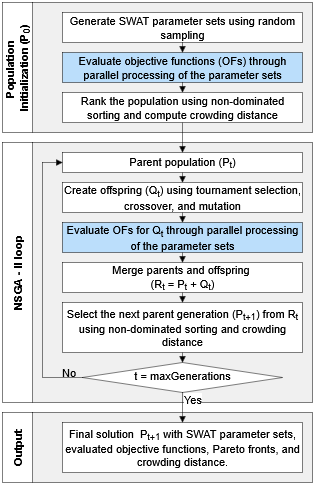

# Summary

The Soil and Water Assessment Tool (SWAT) is a widely used ecohydrological model for simulating watershed-scale processes such as streamflow, sediment transport, and nutrient dynamics. Accurately representing these processes requires robust model calibration.

To support this need, `hydroSWAT` is presented as an open-source R package for multi-objective calibration of SWAT. It implements the Non-dominated Sorting Genetic Algorithm II (NSGA-II), featuring parallel execution capabilities to efficiently evaluate large populations of parameter sets. The package supports calibration for the standard SWAT model and its variant for tropical regions (SWAT-T).

`hydroSWAT` enables users to implement flexible calibration configurations, including multi-site (e.g., multiple hydrological stations), multi-variable (e.g., streamflow, sediment), multi-metric (e.g., performance criteria such as the Nash–Sutcliffe Efficiency [NSE] and Percent Bias [PBIAS]), and multi-period (e.g., different evaluation periods per objective) strategies. These capabilities enhance the robustness and realism of model calibration for diverse hydrological applications.

Beyond calibration, `hydroSWAT` includes tools for preparing forcing data, running simulations, evaluating performance, and conducting post-calibration analysis—all within a unified R-based workflow.

A built‑in dataset and a vignette implementing the full calibration and results analysis workflow are included within the package to support reproducibility and facilitate user adoption.

# Statement of need

The SWAT model [@Arnold1998] is among the most widely used ecohydrological models worldwide [@Gassman2014; @Tan2020], simulating watershed-scale hydrology, vegetation dynamics, sediment transport, and nutrient and pesticide fluxes [@Neitsch2011]. Achieving reliable simulations requires robust parameter calibration to address the mismatch between model complexity and data availability [@Devak2017]. Traditional calibration approaches often rely on single-objective optimization, such as maximizing the Nash–Sutcliffe Efficiency (NSE), which tends to favor high flows but does not guarantee an appropriate representation of low-flow conditions or internal hydrological processes [@Fernandez-Palomino2020]. These limitations can be addressed through multi-objective calibration frameworks, which can provide a more consistent simulation of hydrological processes—including both high and low flows—and increase parameter identifiability while reducing equifinality [@Fernandez-Palomino2020].

Several tools have been developed to support SWAT calibration. SWAT-CUP [@Abbaspour2015] supports calibration via single-objective optimization algorithms but is closed-source and difficult to integrate into reproducible workflows. In the R environment, the SWATrunR [@christoph_schuerz_2022_6517027] package facilitates parallel execution of model runs with structured outputs but does not include calibration functionality. The RSWAT [@Nguyen2022] package enables single-objective calibration but lacks support for multi-objective calibration. In the Python environment, a flexible calibration framework based on NSGA-II [@Deb2002]—an evolutionary algorithm widely applied in hydrological model optimization—was developed by @Ercan2016. However, because it is implemented entirely in Python, its accessibility for R users remains limited.

To fill this gap, `hydroSWAT` was developed as the first fully open-source R package to support multi-objective calibration workflows for SWAT. `hydroSWAT` integrates model configuration, execution, calibration, performance evaluation, and post-processing into a unified R-based workflow. It implements a robust multi-objective calibration framework based on NSGA-II, enhanced with parallel processing to efficiently evaluate large parameter populations. Notably, `hydroSWAT` operates on a pre-existing SWAT model project (TxtInOut files) and requires the standard SWAT executable.

# Functionality overview

## Preparation of forcing data

`hydroSWAT` provides tools to convert gridded climate datasets (e.g., in NetCDF format) into SWAT-compatible input files by computing areal averages at the subbasin level. This facilitates the integration of spatially distributed climate data, including satellite observations, locally interpolated meteorological products, and outputs from regional or global climate models.

## Multi-objective calibration framework

`hydroSWAT` implements a robust multi-objective calibration framework for the SWAT model using NSGA-II algorithm. It identifies non-dominated solutions that simultaneously optimize multiple objective functions, producing a Pareto front that represents trade-offs among competing objectives, such as the joint calibration of high and low flows.

`hydroSWAT` extends the NSGA-II algorithm implemented in the `nsga2R` package [@Tsou2022] to support SWAT-specific calibration tasks, with the addition of parallel processing as a key enhancement (Fig. 1). This extension reduces computation time by parallelizing two critical stages of the algorithm: (i) the evaluation of the initial population of parameter sets, and (ii) the evaluation of offspring generated in each generation through genetic operators.

A typical multi-objective calibration workflow in `hydroSWAT` includes the following steps:

-   Creating a calibration project from an existing SWAT model (TxtInOut folder), previously generated using QSWAT or ArcSWAT.
-   Configuring the simulation, including the start and end dates, spin-up period, simulation time step, and required output variables.
-   Defining objective functions, specifying the performance metric (e.g., NSE or log-NSE), target variable, hydrological unit (reach, subbasin, or HRU), temporal evaluation scale (daily or monthly), and calibration period. For this purpose, the package includes 22 performance metrics commonly used in hydrological modeling, many of which are based on functions from the widely used `hydroGOF` package [@hydroGOF].
-   Defining parameters to calibrate, specifying their search ranges, corresponding SWAT input files, and the modification method (absolute or relative change). `hydroSWAT` supports the calibration of up to 376 parameters from SWAT.
-   Running NSGA-II in parallel using multiple cores to accelerate the evaluation of each generation. Alternatively, the algorithm can be executed sequentially using the base implementation from `nsga2R` [@Tsou2022].
-   Identifying a compromise solution using a goal programming approach, selecting the parameter set closest to the ideal point (i.e., the theoretical optimum across all objectives).

A step-by-step case study illustrating the multi-objective calibration workflow is available in the [`hydroSWAT` GitHub repository](https://github.com/fernandezpalomino/hydroSWAT).

## Model performance evaluation

`hydroSWAT` enables the evaluation of model performance using up to 22 metrics, automatically applied to user-defined periods and simulated variables (e.g., streamflow or sediment). To complement these metrics, the package generates diagnostic plots such as hydrographs (e.g., at daily and monthly scales and average annual cycles) and flow duration curves, providing a more comprehensive evaluation of model performance.

## Post-calibration analysis

`hydroSWAT` facilitates post-calibration analysis by enabling the aggregation of SWAT outputs across multiple spatial scales (HRU, subbasin, river reach, and watershed), temporal scales (daily, monthly, annual, and mean annual cycle), and by soil type. This functionality enables the spatiotemporal analysis of simulated hydrological processes and their role in the overall water balance.

# Future directions

While `hydroSWAT` currently supports multi-objective calibration for SWAT and its variant, SWAT-T [@Alemayehu2017], future developments aim to extend compatibility to SWAT+, the next-generation and restructured version of the SWAT model [@Bieger2017]. Community feedback and contributions are welcome via the `hydroSWAT` GitHub repository.

# Acknowledgements

The author gratefully acknowledges **Yakuandes** for supporting the development of the `hydroSWAT` package.

# References
